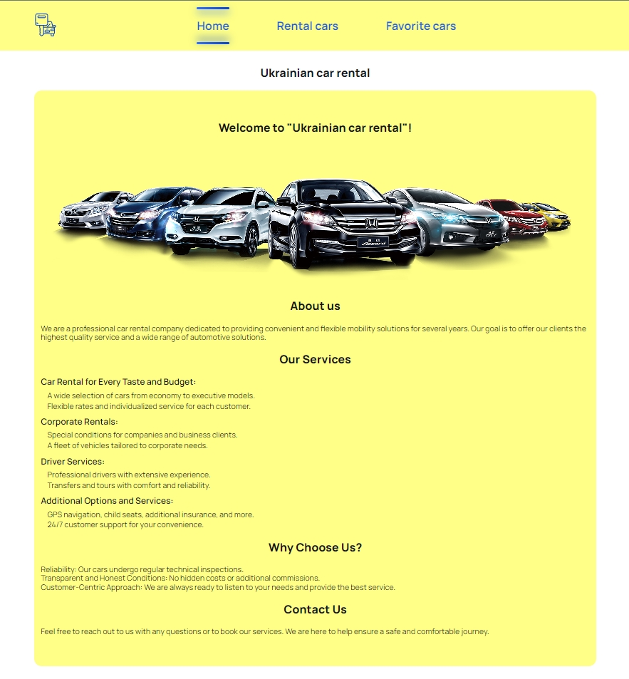
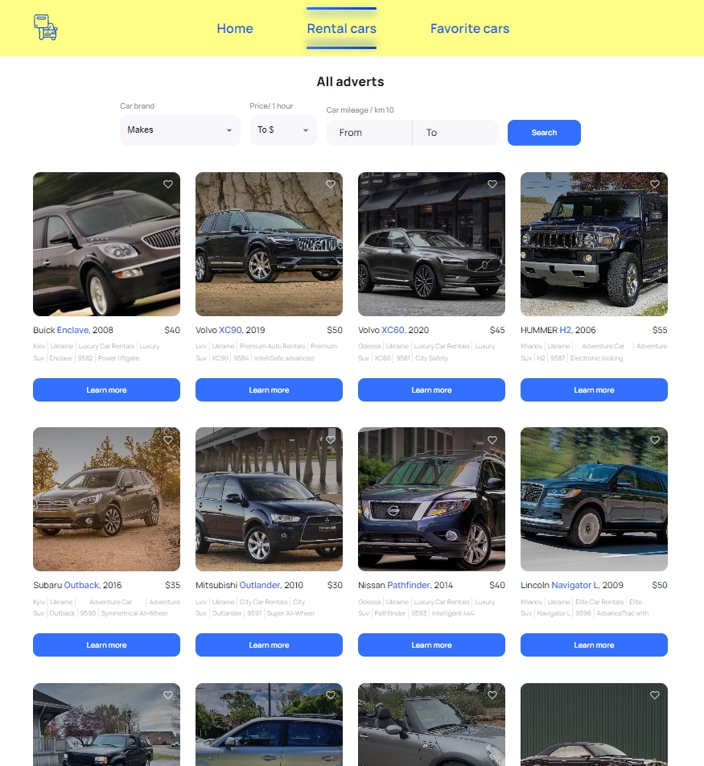
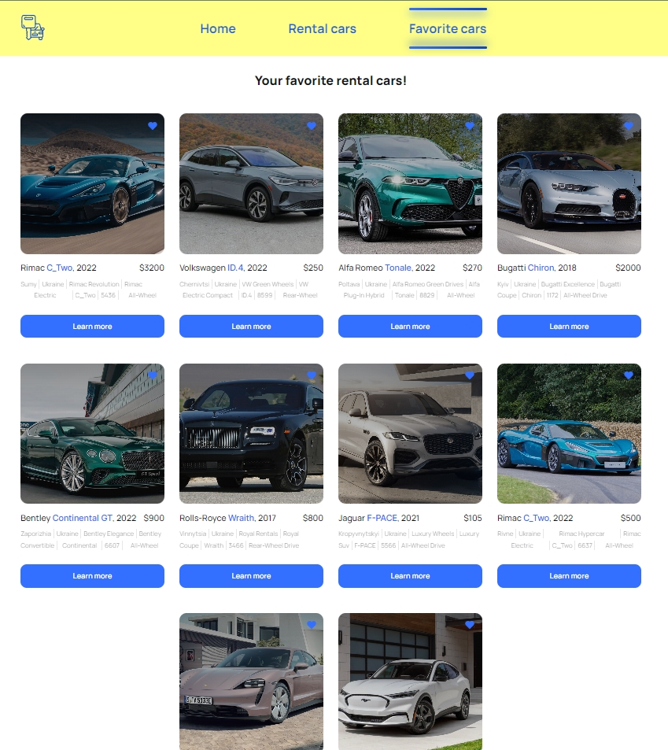
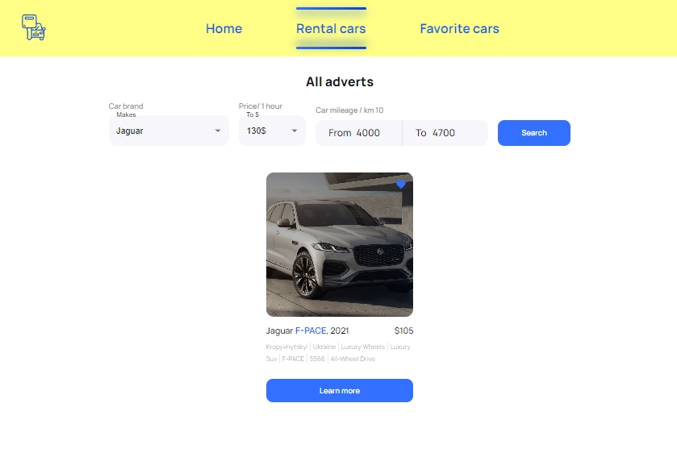

# **_Drive Dazzle_**

This site is intended for car rental in Ukraine

## Site structure

The site has a `Home page`

An `All Cars` page with all available rental cars

And a `Favorite Rental Cars` page.

## Functional

- You can view information about each interested car.
  
- Add car to favorites.
- Filter the list of cars. 
- Load more cars for a wide selection.

## Additional Information

> This site is also designed with a layout and additionally adapted for all
> devices.

> React and Redux were used for work. The Axios library is used for queries

> The project is deployed on netlify.com:
> [Drive Dazzle](https://drive-dazzle.netlify.app/)

[Figma](https://www.figma.com/file/XhC8FSCfAkraEF5l7Hx4fL/Test?type=design&node-id=0%3A1&mode=design&t=i35KsHCSIyGSn1ML-1)

**_Nice wheels of choice!😉_**

[^ Up to start ^](#start)
